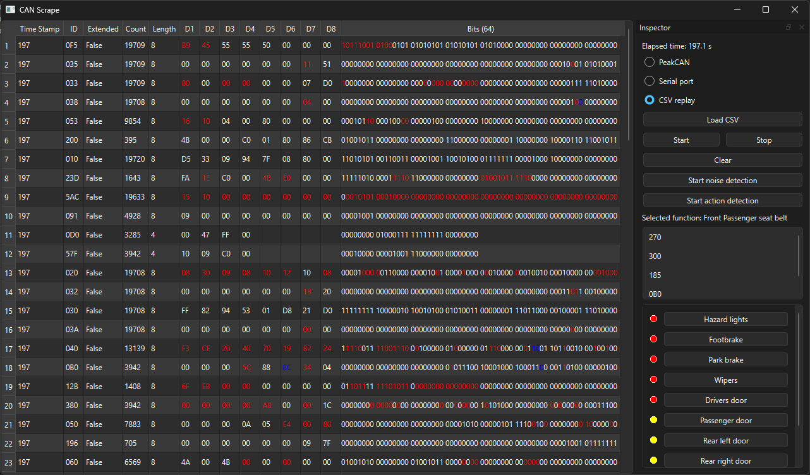

# Thesis project - Can Scrape

The goal of this project is to investigate if machine learning can be used as an effective tool to reverse engineer CAN bus messages. Although the solution developed in this project may not be a complete solution, it provides a solid foundation for future work.

# Requirements:

1. Python 3.14 or later
1. python-can, numpy, pandas, scikit-learn (pip install)
1. PeakCAN drivers (https://www.peak-system.com/products/hardware/external-pc-interfaces/pcan-usb/)
