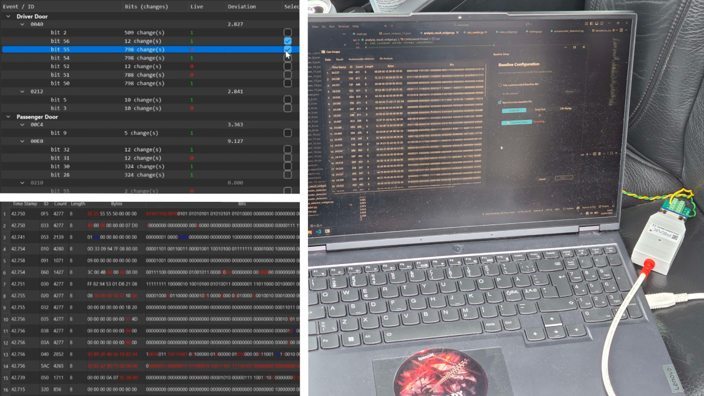
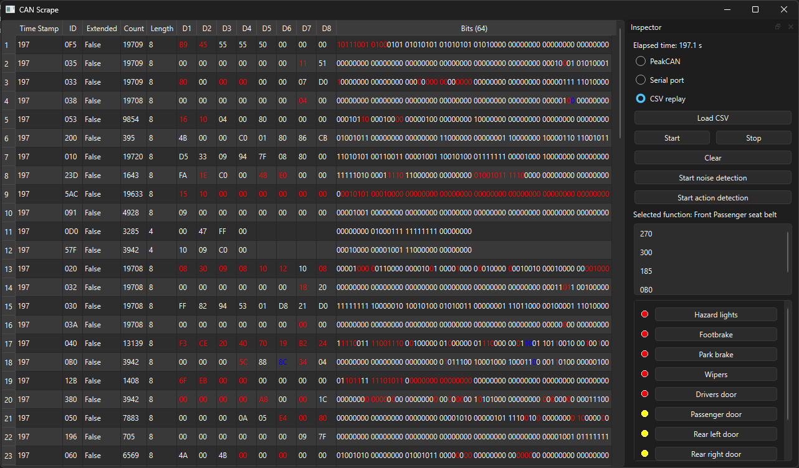

# Thesis Project - Can Scrape

The goal of this project was to develop an easy‑to‑use tool that assists with reverse engineering the CAN bus in cars.

## Images




# Gettings Started

## Prerequisites

- Python (3.14 or later)
- PeakCAN drivers (https://www.peak-system.com/products/hardware/external-pc-interfaces/pcan-usb/)

## Installing

```
# Download project
git clone https://github.com/elias4096/canscrape.git
cd canscrape

# Install dependencies
python -m pip install PySide6 python-can pyserial numpy pandas scikit-learn pyod

# Run app
cd src
python main.cpp
```
